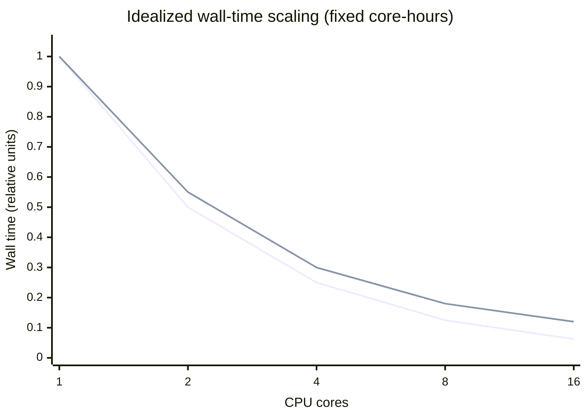
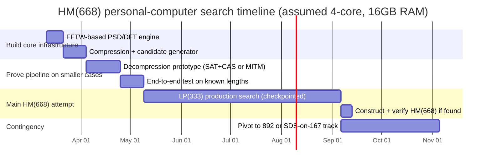

=668\Rightarrow q=667\) (not a prime power) or \(2(q+1)=668\Rightarrow q=333\) (also not a prime power). Therefore Paley does not directly construct 668 (though Paley-based ingredients can still appear inside more complex arrays). (Paley forms cited; arithmetic is direct.)

More generally, the persistent “hard cases” for \(4v\) have historically been linked to **primes \(v\equiv 3\pmod 4\)**; after construction of \(4\cdot 251=1004\), an updated list of remaining \(v<500\) with unknown \(4v\) contained primes \(167,179,223,\dots\), i.e., exactly the cores of 668, 716, 892. ([arxiv.org](https://arxiv.org/pdf/1301.3671))

### A concrete “structured” requirement behind Goethals–Seidel / cyclic SDS searches

A major modern pipeline searches for structured combinatorial objects—**supplementary difference sets (SDS)**—and then constructs a Hadamard matrix via the **Goethals–Seidel array**. ([files.ele-math.com](https://files.ele-math.com/articles/oam-03-33.pdf)) For an abelian group \(A\) of order \(n\), an SDS \((A_1,A_2,A_3,A_4)\) has parameters \((n;k_1,k_2,k_3,k_4;\lambda)\) and in this context must satisfy
\[
\lambda = k_1+k_2+k_3+k_4-n,
\]
and yields four binary (±1) matrices whose autocorrelation-like relation implies the Hadamard condition. ([files.ele-math.com](https://files.ele-math.com/articles/oam-03-33.pdf))

A very strong necessary numerical constraint follows from the same framework: if \(a_i=n-2k_i\) are the row sums of the associated ±1 circulant/core matrices, then
\[
a_1^2+a_2^2+a_3^2+a_4^2 = 4n.
\]
([files.ele-math.com](https://files.ele-math.com/articles/oam-03-33.pdf))

Applied to the “core” \(n=167\) (i.e., order \(4n=668\)), this forces \(a_i\) to be odd integers with squares summing to \(4n=668\). Using the constraint above, the feasible \((a_1,a_2,a_3,a_4)\) (up to ordering) are limited; translating back to \(k_i=(n-a_i)/2\) gives a short list of **parameter candidates** for any cyclic-SDS/Goethals–Seidel attempt.

### Candidate SDS parameter sets for \(n=167\) forced by the row-sum square constraint

The following are the **only** positive-odd \((a_1,a_2,a_3,a_4)\) solutions (sorted) to \(\sum a_i^2=668\), and the induced \((k_i,\lambda)\) via \(k_i=(167-a_i)/2\), \(\lambda=\sum k_i-167\). This is derived directly from the cited constraint. ([files.ele-math.com](https://files.ele-math.com/articles/oam-03-33.pdf))

| \( (a_1,a_2,a_3,a_4)\) | \( (k_1,k_2,k_3,k_4)\) | \(\lambda\) |
|---|---|---:|
| (25, 5, 3, 3) | (71, 81, 82, 82) | 149 |
| (23, 11, 3, 3) | (72, 78, 82, 82) | 147 |
| (23, 9, 7, 3) | (72, 79, 80, 82) | 146 |
| (21, 15, 1, 1) | (73, 76, 83, 83) | 148 |
| (21, 13, 7, 3) | (73, 77, 80, 82) | 145 |
| (21, 11, 9, 5) | (73, 78, 79, 81) | 144 |
| (19, 17, 3, 3) | (74, 75, 82, 82) | 146 |
| (19, 15, 9, 1) | (74, 76, 79, 83) | 145 |
| (17, 17, 9, 3) | (75, 75, 79, 82) | 144 |
| (15, 15, 13, 7) | (76, 76, 77, 80) | 142 |

Crucially, these are only *numerically feasible*—they do not imply existence of an SDS, but they narrow the search to a small set of parameter targets consistent with the Goethals–Seidel/SDS framework. ([files.ele-math.com](https://files.ele-math.com/articles/oam-03-33.pdf))

### Alternative pathway: two-circulant-core construction via Legendre pairs

A distinct structured route uses **two circulant cores**; a key theorem family states that under suitable “almost perfect autocorrelation” conditions (Legendre pairs / generalized Legendre pairs), one can build a Hadamard matrix of order \(2\ell+2\). ([documents.uow.edu.au](https://documents.uow.edu.au/~jennie/WEB/WEB06/kksAJC.pdf)) This is precisely the form relevant to 668 because
\[
668 = 2\cdot 333 + 2.
\]
So, a **Legendre pair of length \(\ell=333\)** would immediately yield a 2cc Hadamard matrix of order 668.

Legendre pairs are widely studied in this context, and there is an explicit research program viewing “Legendre pairs exist for every odd length” as a structured strengthening that would imply the Hadamard conjecture. ([par.nsf.gov](https://par.nsf.gov/servlets/purl/10653641))

### What can be ruled out: circulant Hadamard and other overly restrictive subfamilies

Even if HM(668) exists, it is known that some tempting restricted families are impossible or extremely constrained. In particular, a *circulant* Hadamard matrix of order \(n\) (if one exists) must have order \(n=4m^2\) for odd \(m\), a constraint attributed to Turyn’s work on character sums/difference sets. ([msp.org](https://msp.org/pjm/1965/15-1/pjm-v15-n1-p32-s.pdf)) Consequently, **668 is not of the form \(4m^2\)**, so it cannot be circulant; hence “try a circulant Hadamard of order 668” is a dead end and any feasible search must use more general block/cocyclic/difference-family structure. (Turyn cited; arithmetic is direct.)

## Survey of computational search methods for Hadamard matrices and related objects

The computational history of Hadamard matrices strongly suggests a pattern: **general brute force is hopeless**, but **structured constructions + algorithmic ingenuity** can move the frontier.

### Representative historical and modern methods (with strengths/limitations)

| Method family | What is searched | Why it can work | Key limitations for 668 |
|---|---|---|---|
| Exhaustive / backtracking with equivalence pruning | Rows/columns of \(H\) directly (plus normalization) | Works for classification at small orders; can exploit Hadamard equivalence (row/col negations, permutations). ([webspace.maths.qmul.ac.uk](https://webspace.maths.qmul.ac.uk/l.h.soicher/designtheory.org/library/encyc/topics/had.pdf)) | Search space explodes; even “direct SAT” performs poorly beyond tiny \(n\) without deep structure. ([cs.curtisbright.com](https://cs.curtisbright.com/reports/jar.pdf)) |
| Construction-first (difference sets/SDS) + Goethals–Seidel array | SDS in cyclic/abelian groups; then construct \(H\) | Reduces to structured subset/difference constraints; amenable to orbit methods, meet‑in‑the‑middle, hashing. ([arxiv.org](https://arxiv.org/pdf/1301.3671)) | For core 167 (prime), orbit methods have weaker subgroup options than for many other sizes, potentially making enumeration huge. ([arxiv.org](https://arxiv.org/pdf/1301.3671)) |
| Union-of-orbits + hashing-based matching (meet-in-the-middle) | Candidate orbit-union blocks recorded as integer-tuples; match sums to constant tuple | Scales to cases where each file has ~10 million lines: hashing avoids \(10^{14}\) intermediate blowup; parallelizes naturally. ([arxiv.org](https://arxiv.org/pdf/1301.3671)) | Requires substantial orbit compression to keep files manageable; prime cores with “unfriendly” \(p-1\) factorization can undermine this. ([arxiv.org](https://arxiv.org/pdf/1301.3671)) |
| SAT/SMT encodings with symmetry breaking | Boolean variables for entries (or for defining sequences/blocks) | CDCL SAT solvers excel when structure is strong and symmetries are broken; can be combined with domain-specific constraints. ([cs.curtisbright.com](https://cs.curtisbright.com/reports/good.pdf)) | Straight encodings scale poorly; for Hadamard-like constraints, success usually demands hybrid SAT+CAS (Fourier filters, algebraic lemmas) and splitting. ([cs.curtisbright.com](https://cs.curtisbright.com/reports/jar.pdf)) |
| Programmatic SAT+CAS (Fourier-domain “theory lemmas”) | Structured matrices (good/best/Williamson-like); SAT explores, CAS checks spectral constraints | Demonstrated ability to exhaustively resolve larger structured cases by learning conflict clauses from FFT/DFT constraints. ([cs.curtisbright.com](https://cs.curtisbright.com/reports/good.pdf)) | For order 167 objects, instance size may still be far beyond published enumerations (often ≤70); requires careful splitting and heavy optimization. ([cs.curtisbright.com](https://cs.curtisbright.com/reports/good.pdf)) |
| Heuristic optimization (hill climbing, simulated annealing, genetic algorithms) | Treat Hadamard condition as an objective to minimize | Can rapidly find examples when solutions are “dense”; useful for exploratory search and for restricted families like 2cc. ([arxiv.org](https://arxiv.org/abs/1606.03815)) | No completeness guarantees; for open orders like 668, heuristic failures are hard to interpret (no proof of nonexistence). ([nature.com](https://www.nature.com/articles/s41598-021-03586-0)) |

### Anchoring examples: what “worked” historically, and what it implies for and against PC feasibility

- The “order‑92 breakthrough” was reported as a discovery via computation in the early modern era of the problem. ([ams.org](https://www.ams.org/journals/bull/1962-68-03/S0002-9904-1962-10761-7/S0002-9904-1962-10761-7.pdf))
- The order‑428 breakthrough, previously the smallest open order, required an algorithmic split strategy and was reported run on a small cluster (sixteen PCs). ([math.ipm.ac.ir](https://math.ipm.ac.ir/~tayfeh-r/hadamard428.htm))
- For order \(4\cdot 251=1004\), the construction succeeded by combining orbit-union SDS generation with a hashing-based matching algorithm, explicitly motivated by the infeasibility of naive meet-in-the-middle storage (petabyte-scale blowups). ([arxiv.org](https://arxiv.org/pdf/1301.3671))
- Modern SAT+CAS successes in adjacent combinatorial matrix families rely heavily on enforcing spectral/Fourier constraints during search, rather than encoding everything purely as Boolean constraints. ([cs.curtisbright.com](https://cs.curtisbright.com/reports/good.pdf))

These examples collectively support a cautious conclusion: **commodity hardware can be enough** when the search can be reduced to *structured subproblems* with strong pruning; but for 668, the necessary structure is not yet known.

## Complexity and resource estimates for order 668 on a typical personal computer

### Hardware assumptions

Unless specified otherwise, assume:

- 4 CPU cores (single machine), ~3–4 GHz class
- 16 GB RAM
- No GPU
- SSD storage available (important for large intermediate lists)

### Why direct search is infeasible (order-of-magnitude)

Even after normalizing the first row and column (standard symmetry breaking), a direct ±1 matrix still has roughly \((668-1)^2\approx 4.4\times 10^5\) unconstrained entries, i.e., a raw space of size \(2^{\Theta(10^5)}\), far beyond any conceivable enumeration. Moreover, experience with SAT indicates that “straight” Hadamard encodings become costly at extremely small sizes (reported in the literature as already problematic at \(n>20\) without structural restriction). ([cs.curtisbright.com](https://cs.curtisbright.com/reports/jar.pdf))

Thus any feasible plan must instead search for smaller *defining objects*: circulant cores, SDS blocks, Legendre pairs, good/best/Williamson-like matrices, etc.

### A realistic baseline: what resource-scaled searches have looked like

Two useful empirical anchors:

- Order‑428 effort: implemented “on a cluster of sixteen 2.6 GHz PCs” and found the solution “after about 12 hours.” ([math.ipm.ac.ir](https://math.ipm.ac.ir/~tayfeh-r/hadamard428.htm))  
  This demonstrates that *some* frontier problems can be solved with modest clusters, but not that the next open case is comparable.
- Orbit+hashing SDS matching: for a hard instance at \(v=631\), the authors describe files with “approximately 10 million lines each” and explain why naive pairing would create \(10^{14}\) combinations, so they use linear hashing, packing into 64-bit words, and parallel splitting modulo \(M\). ([arxiv.org](https://arxiv.org/pdf/1301.3671))

These show that “frontier” searches already operate at scales where (a) RAM fits only via careful partitioning, and (b) significant parallelism helps.

### Resource-vs-runtime tradeoffs (approximate, but actionable)

Since personal computers are limited mainly by **RAM and wall time**, an effective strategy for 668 should be designed so that:

- peak RAM stays under ~12 GB (leaving room for OS/tooling),
- work is chunked into “independent SAT instances” or “independent orbit-index slices,”
- checkpoints are frequent enough to not lose days of work.

To make the tradeoffs concrete, suppose a strategy can be expressed as “\(C\) core‑hours of independent subproblems.” Then ideal scaling is near-linear: wall time \(\approx C / \#\text{cores}\). In practice, overhead (disk I/O, preprocessing, solver restarts) reduces efficiency.



This chart is not a claim about a specific algorithm’s \(C\); it illustrates why personal-computer feasibility hinges primarily on reducing the search to **parallelizable subproblems** and keeping memory bounded.

### Feasibility assessment by candidate construction family for 668

| Construction/search target | What you must find | Expected fit for 4-core / 16 GB | Main risk |
|---|---|---|---|
| Cyclic SDS in \(\mathbb{Z}_{167}\) (Goethals–Seidel) | One SDS with one of the feasible \((k_i,\lambda)\) sets above; then build \(H\). ([files.ele-math.com](https://files.ele-math.com/articles/oam-03-33.pdf)) | Feasible only if very strong symmetry/multiplier constraints are assumed (to shrink candidates) or if SAT+CAS is highly optimized. | Core \(167\) is prime and offers limited subgroup-orbit compression compared with successes like \(v=251\). ([arxiv.org](https://arxiv.org/pdf/1301.3671)) |
| “Good matrices” / structured circulant blocks of order 167 | A special 4‑tuple of circulant matrices satisfying a spectral condition; yields skew Hadamard of order \(4n\). ([cs.curtisbright.com](https://cs.curtisbright.com/reports/good.pdf)) | Conceivable via programmatic SAT+CAS, but published complete enumerations are far below 167; would require heavy splitting and lots of CPU time. | Might not exist at \(n=167\) (good matrices have known counterexample orders). ([cs.curtisbright.com](https://cs.curtisbright.com/reports/good.pdf)) |
| Legendre pair of length 333 (2cc) | A Legendre pair \((A,B)\) length 333; then 2cc gives \(H_{668}\). ([documents.uow.edu.au](https://documents.uow.edu.au/~jennie/WEB/WEB06/kksAJC.pdf)) | Potentially the most PC-plausible route because length 333 is composite (enabling compression/multiplier pruning) and fast FFT-based PSD computation is central. ([par.nsf.gov](https://par.nsf.gov/servlets/purl/10653641)) | Existence unknown; adding multipliers might exclude solutions; decompression stages can be combinatorially explosive. ([arxiv.org](https://arxiv.org/abs/2101.03116)) |
| Heuristic search only (annealing / local search) | A candidate matrix/sequence that meets constraints | Useful as exploratory pre-filtering, but unlikely to certify existence/nonexistence alone. ([arxiv.org](https://arxiv.org/abs/1606.03815)) | No completeness; hard to publish as a definitive “existence proof” unless full matrix found and validated. ([nature.com](https://www.nature.com/articles/s41598-021-03586-0)) |

A conservative reading of current literature is that **668 remains open partly because no known structured construction has yet produced it**, and articles discussing computational approaches explicitly list 668 among orders “not found by any methods yet due to huge computational resource required” (in the context of certain approaches). ([nature.com](https://www.nature.com/articles/s41598-021-03586-0))

## A concrete personal-computer search strategy for 668

This section proposes a strategy that is *feasible to run on the assumed PC* in the sense of: bounded RAM, chunkable compute, and reproducible artifacts—even though success is uncertain.

### Strategy choice and rationale

Prioritize the **Legendre pair / 2cc route** first, and treat cyclic-SDS-on-\(167\) as a secondary line:

1. 2cc reduces HM(668) to finding **LP(333)**, leveraging an established “two circulant cores” construction pipeline. ([documents.uow.edu.au](https://documents.uow.edu.au/~jennie/WEB/WEB06/kksAJC.pdf))  
2. Modern work on Legendre pair search emphasizes **FFT/DFT and PSD pruning** and presents large speedups via FFTW-enabled code. ([par.nsf.gov](https://par.nsf.gov/servlets/purl/10653641))  
3. Because 333 is composite, you can deploy **compression** (Djoković–Kotsireas compression is specifically highlighted in the Legendre-pair literature as essential for harder open orders). ([par.nsf.gov](https://par.nsf.gov/servlets/purl/10653641))

### Proposed workflow (algorithmic steps and checkpoints)

```mermaid
flowchart TD
  A[Define target: HM(668)] --> B{Choose construction family}
  B -->|2cc / Legendre pairs| C[Target LP(333)]
  B -->|GS / SDS| D[Target cyclic SDS in Z_167]

  C --> C1[Select compression factors of 333: 3, 9, 37, 111]
  C1 --> C2[Generate candidate compressed sequences with balance + PSD/PAF constraints]
  C2 --> C3[Decompress candidates (SAT+CAS or meet-in-the-middle)]
  C3 --> C4[Verify LP(333): PAF(A,s)+PAF(B,s)=-2 for all s≠0]
  C4 --> C5[Build HM(668) via 2cc construction]
  C5 --> V[Validate HHᵀ = 668 I, store artifacts, publish]

  D --> D1[Enumerate feasible (k_i,λ) from row-sum square constraint]
  D1 --> D2[Pick symmetry type or multiplier/orbit constraints]
  D2 --> D3[Generate candidate blocks; compute difference profiles]
  D3 --> D4[Hash-based matching / SAT+CAS to satisfy constant-difference condition]
  D4 --> D5[Build HM(668) via Goethals–Seidel array]
  D5 --> V
```

The Goethals–Seidel/SDS and 2cc/Legendre-pair steps are standard in the cited literature; the novelty here is choosing the 2cc + compression path as the PC-first option. ([files.ele-math.com](https://files.ele-math.com/articles/oam-03-33.pdf)) ([documents.uow.edu.au](https://documents.uow.edu.au/~jennie/WEB/WEB06/kksAJC.pdf))

### Pruning heuristics and symmetry reductions that keep the search “PC-sized”

The key is to organize the computation so that every stage is either:

- \(O(n\log n)\) FFT work on modest arrays, or
- a SAT search instance small enough to fit memory and be restarted, or
- an enumerator that writes/reads compact hashed signatures rather than full vectors.

Recommended, construction-appropriate pruning moves:

1. **Normalization and equivalence breaking (always).**  
   For sequences, fix the first entry (or a small prefix) to reduce negation/shift symmetries; for Hadamard matrices, dephase (first row/column all +1) after construction. Equivalence frameworks and automorphism-group ideas are standard background in Hadamard catalogs. ([webspace.maths.qmul.ac.uk](https://webspace.maths.qmul.ac.uk/l.h.soicher/designtheory.org/library/encyc/topics/had.pdf))

2. **PSD/DFT filtering early and often (Legendre and circulant-block searches).**  
   Modern Legendre-pair search work stresses leveraging the DFT/PSD invariants and accelerating them via FFT-like algorithms; this is essential for any length as high as 333. ([par.nsf.gov](https://par.nsf.gov/servlets/purl/10653641))

3. **Compression-first decomposition (Legendre pairs).**  
   The Legendre-pair literature treats Djoković–Kotsireas compression as a key ingredient for hard lengths and explicitly notes it would be needed for the smallest open lengths (e.g., 115). ([par.nsf.gov](https://par.nsf.gov/servlets/purl/10653641))  
   For 333, plausible compression factors are \(3,9,37,111\), giving compressed lengths \(111,37,9,3\). The search should start at the compressed level to generate drastically fewer candidates (then attempt decompressions).

4. **Meet-in-the-middle hashing for “constant difference vector” matching (SDS route).**  
   The SDS construction success at \(v=631\) shows how hashed matching is used precisely because naive \(10^{14}\) pairwise combinations are infeasible; the methodology (linear hash preserving addition, modulo splitting, parallel buckets) is detailed and directly reusable. ([arxiv.org](https://arxiv.org/pdf/1301.3671))

5. **Programmatic SAT+CAS for structured circulant blocks (secondary route).**  
   If you attempt “good matrices” or related circulant structured 4‑tuples, use the SAT+CAS paradigm: SAT explores assignments; CAS/FFT checks spectral constraints and learns blocking clauses. ([cs.curtisbright.com](https://cs.curtisbright.com/reports/good.pdf))

### Expected runtime ranges (honest, assumption-driven)

Because HM(668) is open, any runtime estimate must depend on how much structure is assumed. Under the PC assumptions:

- **Exploratory/preprocessing phase (FFT + candidate generation):** hours to a few days, mainly writing code, verifying PSD computation correctness, and generating compressed candidates. This is realistic because FFTW is designed for fast DFT of arbitrary sizes and is commonly used for such workloads. ([fftw.org](https://www.fftw.org/fftw3_doc/))
- **Main search phase:** highly uncertain:
  - If **LP(333)** exists with helpful compression patterns and a nontrivial multiplier subgroup (as exploited to settle other lengths \(\ell\equiv 0\bmod 3\)), then a PC search could plausibly complete in **weeks to a few months of wall time** (with heavy pruning and checkpointing). ([arxiv.org](https://arxiv.org/abs/2101.03116))  
  - If those structural assumptions fail, the search can degenerate into enormous decompression branching and become effectively intractable without a cluster.
- **SDS-on-167 phase:** likely the most difficult on a PC unless a new symmetry reduction is found, because the orbit-union method that scaled well for \(v=251\) relies on subgroup structure and large orbit partitions. ([arxiv.org](https://arxiv.org/pdf/1301.3671))

A cautionary marker: some published discussion of computational approaches explicitly groups 668 with “not found yet due to huge computational resource required” (even before considering that the approach in question might not be optimal). ([nature.com](https://www.nature.com/articles/s41598-021-03586-0))

### Candidate validation and reproducibility

If a candidate \(H\) of order 668 is constructed, validation is straightforward and should be done redundantly:

- Check **entry set** is exactly \(\{\pm 1\}\).
- Compute \(HH^\top\) over integers and verify it equals \(668I\). (Definition-level check.) ([arxiv.org](https://arxiv.org/html/2411.18897v2))
- Independently validate with a second toolchain, e.g., implement a simple integer check in C/Python and also verify in **SageMath** using its Hadamard matrix utilities. ([doc.sagemath.org](https://doc.sagemath.org/html/en/reference/combinat/sage/combinat/matrices/hadamard_matrix.html))

Reproducibility practices that match the norms in computational combinatorics:

- Store: the defining sequences/blocks (compressed + decompressed), the construction path (2cc or GS array), and the final matrix in a standard textual format.
- Record: random seeds, solver versions, compiler flags, CPU model, and wall-clock time per stage.
- Provide: a minimal “verification script” that loads the matrix and checks \(HH^\top\). (This is particularly important because construction pipelines can be subtle; the Sage constructions database paper emphasizes correcting/validating literature claims via implementations.) ([arxiv.org](https://arxiv.org/html/2411.18897v2))

## Prioritized action plan, milestones, and probability of success

### Action plan and milestones

| Milestone | Deliverable | Estimated wall time (4-core PC) | “Go/No-Go” checkpoint |
|---|---|---:|---|
| Implement PSD/DFT engine | FFTW-backed code that computes PSD for ±1 sequences length 333 and compressed variants | 1–2 days | Cross-check PSD invariants on known small Legendre pairs from the literature/software. ([par.nsf.gov](https://par.nsf.gov/servlets/purl/10653641)) |
| Compression pipeline | Generate compressed candidate pairs for factors \(3,9,37,111\) with required spectral constraints | 3–14 days | If candidate counts exceed RAM/disk budgets, tighten balance/multiplier constraints or switch compression factor. |
| Decompression solver | Either (a) SAT+CAS decompressor using a modern CDCL solver interface, or (b) meet‑in‑the‑middle decompressor | 2–4 weeks to build + test | Prove end-to-end on a smaller known length (e.g., 63) where modern FFTW-enabled code shows large acceleration. ([par.nsf.gov](https://par.nsf.gov/servlets/purl/10653641)) |
| Main LP(333) search | Run split jobs continuously with checkpointing and logging | 1–12 months (uncertain) | If no progress after a preset budget (e.g., 1–2 months), broaden assumptions: search for LP(333) without multipliers, or pivot to order 892 first. |
| Construct HM(668) | 2cc build and verification | minutes-hours | Require independent code verification + Sage verification. ([doc.sagemath.org](https://doc.sagemath.org/html/en/reference/combinat/sage/combinat/matrices/hadamard_matrix.html)) |
| Secondary: SDS-on-167 | Implement GS/SDS matcher (hashing) and test on known SDS instances | 2–6 weeks | If candidate block generation explodes due to weak orbit partitioning, deprioritize in favor of Legendre-pair line. |

### Timeline visualization



### Estimated probability of success and risk factors (explicitly assumption-based)

Because HM(668) remains open in up-to-date existence tables, any single-machine attempt faces material risk. ([arxiv.org](https://arxiv.org/html/2411.18897v2)) Under the proposed plan:

- **Probability of success on a single personal computer within ~6 months:** **low to moderate (≈ 5–15%)**, primarily because success depends on HM(668) existing in the *chosen structured family* (LP(333) with workable compression/multipliers) rather than merely existing in principle. This is consistent with the fact that 668 has resisted constructions that cover almost all other orders ≤1000. ([arxiv.org](https://arxiv.org/html/2411.18897v2))
- **Probability of obtaining a publishable “nonexistence” proof from computation:** **near zero** on a PC, because (a) nonexistence would require proving no solutions exist in *all* families or providing a theoretical obstruction, and (b) negative computational results usually certify only a restricted family (e.g., no circulant solutions of a given kind). ([cs.curtisbright.com](https://cs.curtisbright.com/reports/good.pdf))
- **Main risk factors**
  - *Wrong family*: HM(668) may exist but not as a 2cc matrix from LP(333) and not via a manageable cyclic-SDS family. ([documents.uow.edu.au](https://documents.uow.edu.au/~jennie/WEB/WEB06/kksAJC.pdf))
  - *Weak symmetry leverage*: the canonical “union-of-orbits” success stories rely on rich subgroup structure; prime cores are precisely where this is weakest. ([arxiv.org](https://arxiv.org/pdf/1301.3671))
  - *Engineering difficulty*: achieving the necessary pruning requires careful, bug-free FFT/PSD code and disciplined checkpointing/logging; published work emphasizes verification and correctness checking of prior constructions via implementation. ([arxiv.org](https://arxiv.org/html/2411.18897v2))

### Suggested tools and libraries to prioritize (practical shortlist)

- **SageMath** for construction/verification harnesses and to reuse the construction catalog interfaces. ([doc.sagemath.org](https://doc.sagemath.org/html/en/reference/combinat/sage/combinat/matrices/hadamard_matrix.html))  
- **FFTW** for high-performance DFT/PSD computation that sits at the core of Legendre-pair filtering. ([fftw.org](https://www.fftw.org/fftw3_doc/))  
- **SAT infrastructure**
  - **PySAT** for rapid prototyping/splitting and solver orchestration in Python. ([pysathq.github.io](https://pysathq.github.io/docs/html/))  
  - **CaDiCaL / Kissat** as modern CDCL solvers if building a SAT(+CAS) decompressor or a structured block search; both are documented and widely used. ([fmv.jku.at](https://fmv.jku.at/cadical/)) ([fmv.jku.at](https://fmv.jku.at/kissat/))  
- **GAP** (optional) to handle group actions/multipliers cleanly if exploiting automorphism or multiplier subgroups. ([gap-system.org](https://www.gap-system.org/))

These choices align with the dominant computational primitives in modern work on structured Hadamard-adjacent objects: FFT-based spectral filtering, SAT-guided search, and group-theoretic symmetry exploitation. ([arxiv.org](https://arxiv.org/pdf/1301.3671))